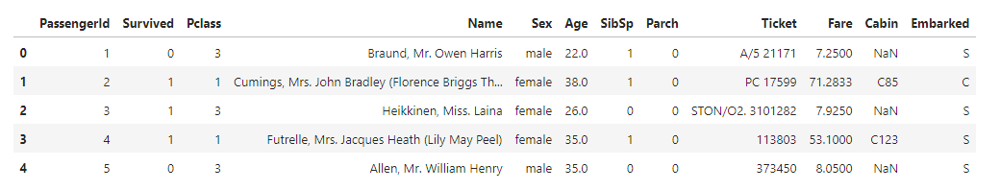
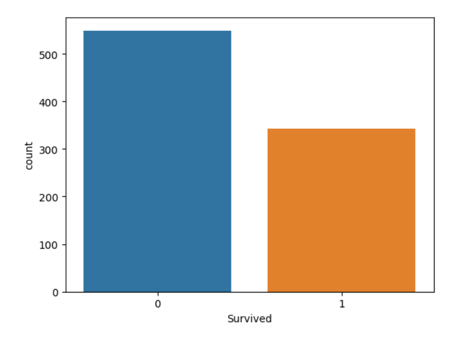
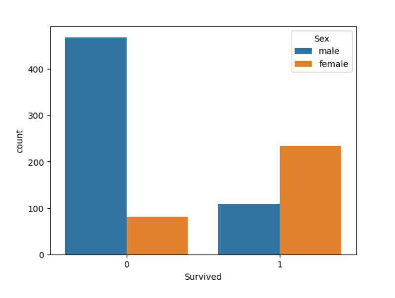

<p>
    
    
    
    
</p>
# The Titanic Dataset: A Step-by-Step Guide to Predicting Survival | Jupyter-lab & python script | Kaggle | 💀 😀

In this project, we plan to build a model step by step to predict the life conditions of other passengers with the help of machine learning.

This challenge has been published on the Kaggle website. [see this challenge on Kaggle](https://www.kaggle.com/competitions/titanic/overview)


## The goal of the challenge

Predicting the status of passengers in terms of whether they are alive or dead.

## Data

There is a file `train.csv` exist that includes 891 records (without features or header).

### Data Dictionary

| **Variable** |               **Definition**               |                    **Key**                     |
| :----------: | :----------------------------------------: | :--------------------------------------------: |
|   survival   |                  Survival                  |                0 = No, 1 = Yes                 |
|    pclass    |                Ticket class                |           1 = 1st, 2 = 2nd, 3 = 3rd            |
|     sex      |                    Sex                     |                                                |
|     Age      |                Age in years                |                                                |
|    sibsp     | # of siblings / spouses aboard the Titanic |                                                |
|    parch     | # of parents / children aboard the Titanic |                                                |
|    ticket    |               Ticket number                |                                                |
|     fare     |               Passenger fare               |                                                |
|    cabin     |                Cabin number                |                                                |
|   embarked   |            Port of Embarkation             | C = Cherbourg, Q = Queenstown, S = Southampton |

### Variable Notes

**pclass**: A proxy for socio-economic status (SES)
`1st `= Upper
`2nd `= Middle
`3rd `= Lower

**age**: Age is fractional if less than 1. If the age is estimated, is it in the form of xx.5

**sibsp**: The dataset defines family relations in this way...
`Sibling `= brother, sister, stepbrother, stepsister
`Spouse `= husband, wife (mistresses and fiancés were ignored)

**parch**: The dataset defines family relations in this way...
`Parent `= mother, father
`Child `= daughter, son, stepdaughter, stepson
Some children travelled only with a nanny, therefore parch=0 for them.

## Let's Do it 💪

Continue step by step with me.

### Step1. Data Collection

Data collection is the process of obtaining relevant data from various sources for a specific purpose. It involves identifying the sources, gathering the data in various formats, and ensuring its accuracy and completeness. The quality and quantity of the collected data are crucial to the success of machine learning projects.

👉 Link Download from Kaggle: [Link](https://www.kaggle.com/competitions/titanic/data?select=train.csv)


> 📚 pandas: for data manipulation and analysis.

```python
import pandas as pd
train = pd.read_csv('train.csv')
test = pd.read_csv('test.csv')
```


### Step2. Data Exploration

Data exploration is the crucial step of analyzing and understanding a dataset to identify patterns, relationships, and trends. It involves summarizing, visualizing, feature engineering, hypothesis testing, and identifying data quality issues. This iterative process helps ensure the data is properly understood and prepared for building more accurate and effective machine learning models.


By using `info()` I can find out how many columns there are, and what their data types are.

> 📚 seaborn: for data visualization

```python
train.info()
```

```bash
<class 'pandas.core.frame.DataFrame'>
RangeIndex: 891 entries, 0 to 890
Data columns (total 12 columns):
 #   Column       Non-Null Count  Dtype  
---  ------       --------------  -----  
 0   PassengerId  891 non-null    int64  
 1   Survived     891 non-null    int64  
 2   Pclass       891 non-null    int64  
 3   Name         891 non-null    object 
 4   Sex          891 non-null    object 
 5   Age          714 non-null    float64
 6   SibSp        891 non-null    int64  
 7   Parch        891 non-null    int64  
 8   Ticket       891 non-null    object 
 9   Fare         891 non-null    float64
 10  Cabin        204 non-null    object 
 11  Embarked     889 non-null    object 
dtypes: float64(2), int64(5), object(5)
memory usage: 83.7+ KB
```

There're 12 columns


❔ How many missing values are there in each column?

```python
train.isna().sum()
```

```
PassengerId      0
Survived         0
Pclass           0
Name             0
Sex              0
Age            177
SibSp            0
Parch            0
Ticket           0
Fare             0
Cabin          687
Embarked         2
dtype: int64
```

The columns `Age`, `Cabin`, and `Mounted` have missing values.


By using `head()` can see the top 5 first rows of data frame.

```python
train.head()
```



```python
import seaborn as sns

sns.countplot(x='Survived', data=train)
```



```python
sns.countplot(x='Survived', hue='Sex', data=train)
```




### Step3. Data Cleaning

Data cleaning is the process of identifying and correcting errors, inconsistencies, and inaccuracies in a dataset. It involves identifying missing data, removing duplicates, standardizing data, correcting errors, handling outliers, and ensuring data consistency. This iterative process is crucial for ensuring the accuracy and performance of machine learning models.


```python
train_df.drop(['PassengerId', 'Name', 'Ticket', 'Cabin'], axis=1, inplace=True)

train_df['Age'].fillna(train_df['Age'].mean(), inplace=True)
train_df.dropna(inplace=True)

sex = pd.get_dummies(train_df['Sex'], drop_first=True)
embark = pd.get_dummies(train_df['Embarked'], drop_first=True)

train_df.drop(['Sex', 'Embarked'], axis=1, inplace=True)
train_df = pd.concat([train_df, sex, embark], axis=1)
```


### Step4. Feature Engineering

Feature engineering is the process of selecting and transforming features in a dataset to create new, more meaningful features that improve the performance of machine learning models. This involves feature selection, extraction, scaling, encoding, and dimensionality reduction. It's an iterative process that can improve the accuracy and effectiveness of machine learning models.


> 📚 matplotlib: for data visualization

```
import matplotlib.pyplot as plt

sns.heatmap(train_df.corr(), annot=True)
plt.show()
```


### Step5. Data Preprocessing

Data preprocessing involves cleaning, transforming, and preparing raw data for machine learning models. This includes removing noise, handling missing values, normalizing or scaling data, and transforming data into a format that can be used by machine learning algorithms. The process includes data cleaning, integration, transformation, reduction, and splitting. Proper data preprocessing is crucial for improving the quality and usability of data and for achieving better performance and accuracy in machine learning models.


### Step6. Data Splitting

Data splitting is a crucial step in machine learning that divides the dataset into training and testing sets. The training set is used to train the model, and the testing set is used to evaluate its performance on new, unseen data. Common approaches include the hold-out method, cross-validation, and leave-one-out method. Data splitting should be done randomly and in a way that preserves the distribution of the data, which can be achieved by stratified sampling.


> 📚 sklearn (scikit-learn): for machine learning algorithms

```python
from sklearn.model_selection import train_test_split

X = train_df.drop('Survived', axis=1)
y = train_df['Survived']

X_train, X_test, y_train, y_test = train_test_split(X, y, test_size=0.3, random_state=42)

```


### Step7. Model Selection

Model selection is about selecting the best machine learning model for a problem, considering the model architecture, hyperparameters, and optimization algorithm. Different machine learning models, such as decision trees, support vector machines, and neural networks, have their strengths and weaknesses. Model selection involves defining the problem, selecting a performance metric, choosing candidate models, splitting the data, training and evaluating models, selecting the best model based on the validation set, fine-tuning the selected model, and optimizing its performance. It is crucial to choose a model that is suitable for the problem and can generalize well to new data.

```
from sklearn.linear_model import LogisticRegression

logreg = LogisticRegression()
logreg.fit(X_train, y_train)
```


### Step8. Model Training

Model training is the process of adjusting a machine learning model's parameters to fit the training data and make predictions. It involves data preparation, model selection, initialization, training, validation, evaluation, and fine-tuning. The goal is to minimize the loss function and improve the model's ability to generalize to new data. Preprocessing data and selecting appropriate hyperparameters are critical for successful model training.


### Step9. Evaluation

Evaluation assesses the performance of a machine learning model on new data. Metrics like accuracy, precision, recall, F1-score, AUC-ROC, MSE, and MAE are used to evaluate a model's performance. The dataset is split into training, validation, and test sets. Choosing an appropriate metric and tuning hyperparameters are crucial for successful evaluation.


```
from sklearn.metrics import accuracy_score

y_pred = logreg.predict(X_test)
print('Accuracy:', accuracy_score(y_test, y_pred))
```


```
test_df.drop(['PassengerId', 'Name', 'Ticket', 'Cabin'], axis=1, inplace=True)

test_df['Age'].fillna(test_df['Age'].mean(), inplace=True)
test_df['Fare'].fillna(test_df['Fare'].mean(), inplace=True)

sex = pd.get_dummies(test_df['Sex'], drop_first=True)
embark = pd.get_dummies(test_df['Embarked'], drop_first=True)

test_df.drop(['Sex', 'Embarked'], axis=1, inplace=True)
test_df = pd.concat([test_df, sex, embark], axis=1)
```


```
test_pred = logreg.predict(test_df)

submission = pd.DataFrame({
    'PassengerId': pd.read_csv('test.csv')['PassengerId'],
    'Survived': test_pred
})

submission.to_csv('submission.csv', index=False)
```


### Step10. Hyperparameter Tuning

Hyperparameter tuning finds the best hyperparameters for a machine learning model. Hyperparameters control the model's behavior during training and can affect its performance on new data. Examples include learning rate and the number of hidden layers. Tuning can be done through grid search, random search, Bayesian optimization, or genetic algorithms. Success depends on choosing appropriate ranges, search methods, and evaluation on a validation set to avoid overfitting, while considering computational resources.


### Step11. Model Deployment

Model deployment is making a machine learning model available for production use. It can be done by packaging the model in a container and deploying it to a cloud platform, integrating it into an existing system, or exposing it as an API. Monitoring the model's performance is also important to ensure its continued accuracy and value.


### Step12. Monitoring and Maintenance

Model deployment requires continuous monitoring and maintenance to ensure optimal performance. Performance metrics such as accuracy, precision, recall, and F1 score should be tracked to detect degradation in model performance. Maintenance may involve updating the model with new data, algorithms, hyperparameters, or architecture. Versioning is also important for debugging and reproducibility. Monitoring and maintenance are essential for maximizing the value of machine learning models in a changing environment.
