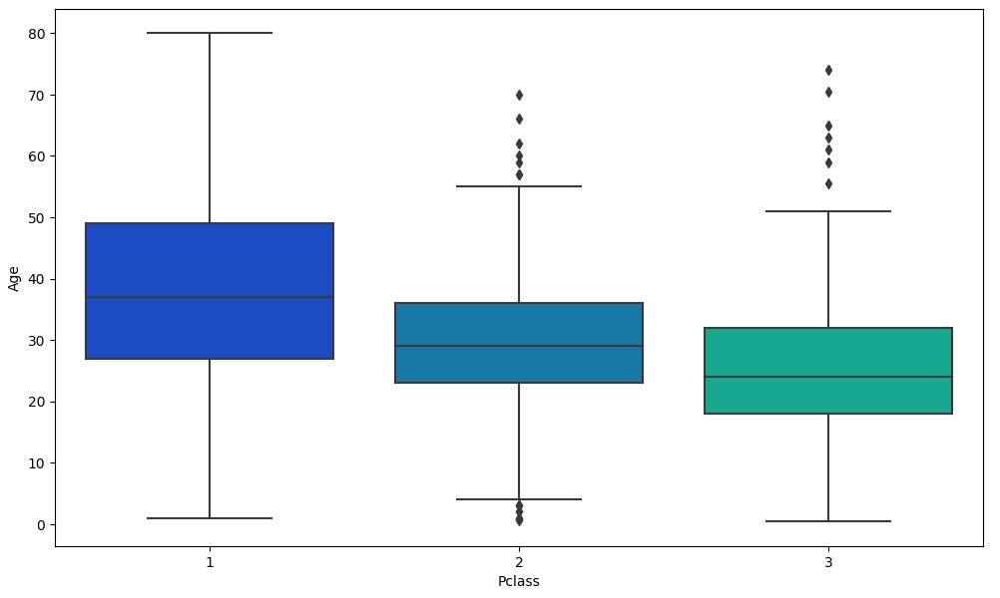
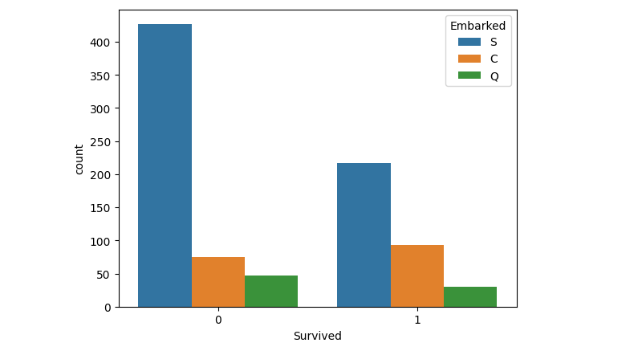
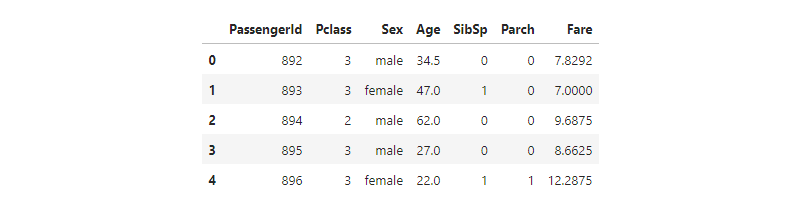
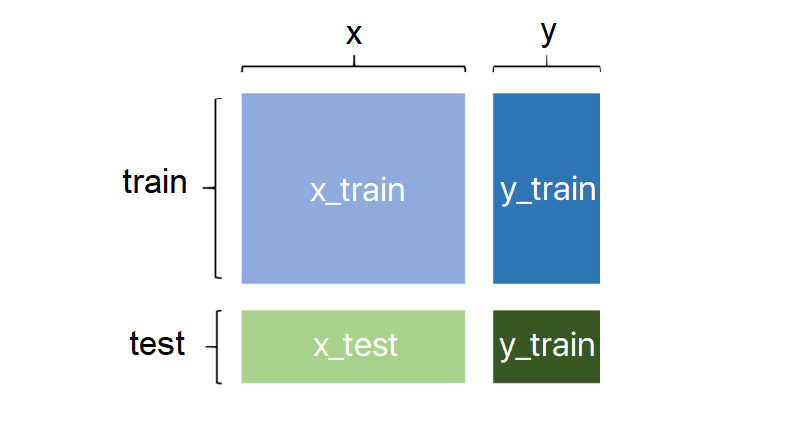
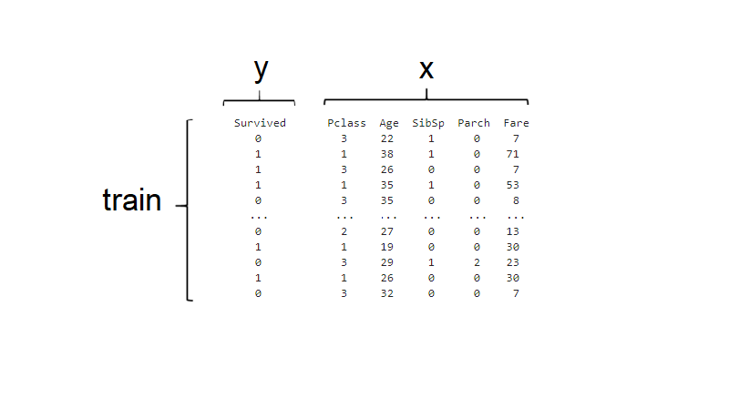
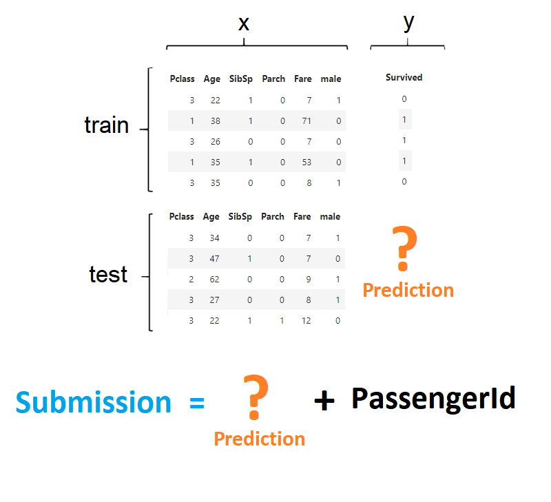

<p>
    
    
    
    
</p>

# The Titanic Dataset: A Step-by-Step Guide to Predicting Survival | 0.77033

In this project, we plan to build a model step by step to predict the life conditions of other passengers with the help of machine learning.

This challenge has been published on the Kaggle website. [see this challenge on Kaggle](https://www.kaggle.com/competitions/titanic/overview)

[Kaggle Notebook](https://www.kaggle.com/arashyeganeh/titanic-predicting-survival)

## The goal of the challenge

Predicting the status of passengers in terms of whether they are alive or dead.

## Data

There is a file `train.csv` exist that includes 891 records (without features or header).

### Data Dictionary

| **Variable** |               **Definition**               |                    **Key**                     |
| :----------: | :----------------------------------------: | :--------------------------------------------: |
|   survival   |                  Survival                  |                0 = No, 1 = Yes                 |
|    pclass    |                Ticket class                |           1 = 1st, 2 = 2nd, 3 = 3rd            |
|     sex      |                    Sex                     |                                                |
|     Age      |                Age in years                |                                                |
|    sibsp     | # of siblings / spouses aboard the Titanic |                                                |
|    parch     | # of parents / children aboard the Titanic |                                                |
|    ticket    |               Ticket number                |                                                |
|     fare     |               Passenger fare               |                                                |
|    cabin     |                Cabin number                |                                                |
|   embarked   |            Port of Embarkation             | C = Cherbourg, Q = Queenstown, S = Southampton |

### Variable Notes

**pclass**: A proxy for socio-economic status (SES)
`1st `= Upper
`2nd `= Middle
`3rd `= Lower

**age**: Age is fractional if less than 1. If the age is estimated, is it in the form of xx.5

**sibsp**: The dataset defines family relations in this way...
`Sibling `= brother, sister, stepbrother, stepsister
`Spouse `= husband, wife (mistresses and fiancés were ignored)

**parch**: The dataset defines family relations in this way...
`Parent `= mother, father
`Child `= daughter, son, stepdaughter, stepson
Some children travelled only with a nanny, therefore parch=0 for them.

## Requirements

* Install the last stable version of `Python`

  [Download Python](https://www.python.org/downloads/)

* Install `JupyterLab` (optional)

  Scripts can be written in any IDE, but `JupyterLab ` makes it easier.

  ```bash
  pip install jupyterlab
  ```

* Install libraries required by this project using pip.

  ```bash
  pip install pandas seaborn matplotlib scikit-learn
  ```

## Let's Do it 💪

Continue step by step with me.

### Step1. Data Collection

Data collection is the process of obtaining relevant data from various sources for a specific purpose. It involves identifying the sources, gathering the data in various formats, and ensuring its accuracy and completeness. The quality and quantity of the collected data are crucial to the success of machine learning projects.

👉 Link Download from Kaggle: [Link](https://www.kaggle.com/competitions/titanic/data?select=train.csv)

> 📚 pandas: for data manipulation and analysis.

```python
import pandas as pd
train = pd.read_csv('train.csv')
test = pd.read_csv('test.csv')
```

### Step2. Data Exploration

Data exploration is the crucial step of analyzing and understanding a dataset to identify patterns, relationships, and trends. It involves summarizing, visualizing, feature engineering, hypothesis testing, and identifying data quality issues. This iterative process helps ensure the data is properly understood and prepared for building more accurate and effective machine learning models.

By using `info()` I can find out how many columns there are, and what their data types are.

```python
train.info()
```

```bash
<class 'pandas.core.frame.DataFrame'>
RangeIndex: 891 entries, 0 to 890
Data columns (total 12 columns):
 #   Column       Non-Null Count  Dtype  
---  ------       --------------  -----  
 0   PassengerId  891 non-null    int64  
 1   Survived     891 non-null    int64  
 2   Pclass       891 non-null    int64  
 3   Name         891 non-null    object 
 4   Sex          891 non-null    object 
 5   Age          714 non-null    float64
 6   SibSp        891 non-null    int64  
 7   Parch        891 non-null    int64  
 8   Ticket       891 non-null    object 
 9   Fare         891 non-null    float64
 10  Cabin        204 non-null    object 
 11  Embarked     889 non-null    object 
dtypes: float64(2), int64(5), object(5)
memory usage: 83.7+ KB
```

There're 12 columns

❔ How many missing values are there in each column?

```python
train.isna().sum()
```

```
PassengerId      0
Survived         0
Pclass           0
Name             0
Sex              0
Age            177
SibSp            0
Parch            0
Ticket           0
Fare             0
Cabin          687
Embarked         2
dtype: int64
```

The columns `Age`, `Cabin`, and `Mounted` have missing values.

By using `head()` can see the top 5 first rows of data frame.

```python
train.head()
```


❔ How many people died?

> 📚 seaborn: for data visualization

```python
import seaborn as sns
sns.countplot(x='Survived', data=train)
```


```python
sns.countplot(x='Survived', hue='Sex', data=train)
```


The age of the people in the ticket class

> 📚 matplotlib: for data visualization

```python
import matplotlib.pyplot as plt
plt.figure(figsize=(12, 7))
sns.boxplot(x='Pclass',y='Age',data=train,palette='winter')
```



Embarkation of people at various ports and the impact on their survival

```python
sns.countplot(x='Survived', hue='Embarked', data=train)
```




| **Column**  | **Missing values** |                         **Describe**                         | Action |
| :---------: | :----------------: | :----------------------------------------------------------: | :----: |
| PassengerId |         0          |          It is not providing any useful information          |   👎    |
|  Survived   |         0          |                              -                               |   ✔️    |
|   Pclass    |         0          |                              -                               |   ✔️    |
|    Name     |         0          |          It is not providing any useful information          |   👎    |
|     Sex     |         0          | The values in this column are currently defined as strings and must be converted into a numerical format for the machine to analyze |   ⚠️    |
|     Age     |        177         |                  it includes missing value                   |   ⚠️    |
|    SibSp    |         0          |                              -                               |   ✔️    |
|    Parch    |         0          |                              -                               |   ✔️    |
|   Ticket    |         0          |          It is not providing any useful information          |   👎    |
|    Fare     |         0          |                              -                               |   ✔️    |
|    Cabin    |        687         | This column has the highest number of missing values in the dataset, and it cannot be correlated with any other features. |   👎    |
|  Embarked   |         2          |          It is not providing any useful information          |   👎    |

* 👎  `It means useless so will delete`
* ✔️ `It means useful`
* ⚠️ `It means Useful but data need to normalize`

### Step3. Data Cleaning

Data cleaning is the process of identifying and correcting errors, inconsistencies, and inaccuracies in a dataset. It involves identifying missing data, removing duplicates, standardizing data, correcting errors, handling outliers, and ensuring data consistency. This iterative process is crucial for ensuring the accuracy and performance of machine learning models.

```python
def CleanData(df, ignorePassengerId = False):
    df['Age'].fillna(df['Age'].mean(), inplace=True)
    df['Fare'].fillna(df['Fare'].mean(), inplace=True)
    
    if ignorePassengerId :
        df.drop(['Name', 'Ticket', 'Cabin', 'Embarked'], axis=1, inplace=True)
    else:
        df.drop(['PassengerId', 'Name', 'Ticket', 'Cabin', 'Embarked'], axis=1, inplace=True)
    
CleanData(train)
CleanData(test, ignorePassengerId = True)
```

```python
train.head()
```


```python
test.head()
```




### Step4. Feature Engineering & Data Preprocessing

Feature engineering is the process of selecting and transforming features in a dataset to create new, more meaningful features that improve the performance of machine learning models. This involves feature selection, extraction, scaling, encoding, and dimensionality reduction. It's an iterative process that can improve the accuracy and effectiveness of machine learning models.

```python
def castColToInt(df, name):
    df[name] = df[name].astype(int)
    return df
    
def FeatureEngineering(df):
    sex = pd.get_dummies(df['Sex'], drop_first=True)
    df.drop(['Sex'], axis=1, inplace=True)
    df = pd.concat([df, sex], axis=1)
    
    castColToInt(df, 'Age')
    castColToInt(df, 'Fare')
    return df
    
train = FeatureEngineering(train)
test = FeatureEngineering(test)
```

```python
train.head()
```


```python
test.head()
```


### Step5. Data Splitting

Data splitting is a crucial step in machine learning that divides the dataset into training and testing sets. The training set is used to train the model, and the testing set is used to evaluate its performance on new, unseen data. Common approaches include the hold-out method, cross-validation, and leave-one-out method. Data splitting should be done randomly and in a way that preserves the distribution of the data, which can be achieved by stratified sampling.





> 📚 sklearn (scikit-learn): for machine learning algorithms

```python
from sklearn.model_selection import train_test_split
X = train.drop('Survived', axis=1)
y = train['Survived']
X_train, X_test, y_train, y_test = train_test_split(X, y, test_size=0.35, random_state=42)
```

### Step6. Model Selection

Model selection is about selecting the best machine learning model for a problem, considering the model architecture, hyperparameters, and optimization algorithm. Different machine learning models, such as decision trees, support vector machines, and neural networks, have their strengths and weaknesses. Model selection involves defining the problem, selecting a performance metric, choosing candidate models, splitting the data, training and evaluating models, selecting the best model based on the validation set, fine-tuning the selected model, and optimizing its performance. It is crucial to choose a model that is suitable for the problem and can generalize well to new data.


in this article, I use the `Logistic Regression` algorithm.

> You can use this library from GitHub to quickly benchmark in multiple algorithms
>
> ```bash
> pip install lazypredict
> ```
>
> [GitHub: lazypredict](https://github.com/shankarpandala/lazypredict)
>
> [Documentation: lazypredict](https://lazypredict.readthedocs.io/en/latest/)


### Step7. Model Training

Model training is the process of adjusting a machine learning model's parameters to fit the training data and make predictions. It involves data preparation, model selection, initialization, training, validation, evaluation, and fine-tuning. The goal is to minimize the loss function and improve the model's ability to generalize to new data. Preprocessing data and selecting appropriate hyperparameters are critical for successful model training.

```python
from sklearn.linear_model import LogisticRegression
logistReg = LogisticRegression(max_iter=1000)
logistReg.fit(X_train, y_train)
```

### Step8. Evaluation

Evaluation assesses the performance of a machine learning model on new data. Metrics like accuracy, precision, recall, F1-score, AUC-ROC, MSE, and MAE are used to evaluate a model's performance. The dataset is split into training, validation, and test sets. Choosing an appropriate metric and tuning hyperparameters are crucial for successful evaluation.

```python
from sklearn.metrics import accuracy_score
prediction = logistReg.predict(X_test)
accuracy = accuracy_score(y_test, prediction)
print("Accuracy: {:.2f}".format(accuracy))
```

> Accuracy: 0.81

### Step9. Hyperparameter Tuning

Hyperparameter tuning finds the optimal set of hyperparameters for a machine learning model, which control the model's behavior during training. Examples of hyperparameters include learning rate, regularization strength, and number of layers/neurons. Hyperparameter tuning can be done through methods like grid search, random search, Bayesian optimization, and genetic algorithms. Successful tuning involves careful selection of hyperparameter range, appropriate search method, and evaluation on a validation set to avoid overfitting. Computational resources should also be considered.

```python
from sklearn.model_selection import GridSearchCV
import warnings

warnings.filterwarnings('ignore')

hyperparameters = {
    'penalty': ['l1', 'l2', 'elasticnet'],
    'C': [0.01, 0.1, 1, 10, 100],
    'solver': ['lbfgs', 'liblinear', 'saga']
}

gridSeCV = GridSearchCV(logistReg, hyperparameters, scoring='accuracy', cv=20)
gridSeCV.fit(X_train, y_train)

prediction = gridSeCV.predict(X_test)
accuracy = accuracy_score(y_test, prediction)

print('Best params', gridSeCV.best_params_)
print('Best score', gridSeCV.best_score_)
print("Accuracy: {:.2f}".format(accuracy))
```

>```python
>Best params {'C': 1, 'penalty': 'l2', 'solver': 'liblinear'}
>Best score 0.7981527093596059
>Accuracy: 0.80
>```

### Step10. Predict



```python
passengerId = test['PassengerId']
test.drop(['PassengerId'], axis=1, inplace=True)
```

```python
prediction = gridSeCV.predict(test)
submission = pd.DataFrame({'PassengerId': passengerId, 'Survived': prediction})
submission.to_csv('submission.csv', index=False)
```


[Kaggle Notebook](https://www.kaggle.com/arashyeganeh/titanic-predicting-survival)