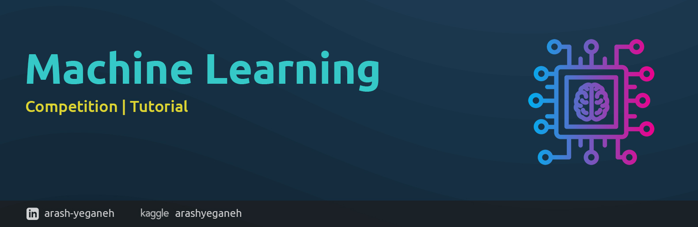

	
	
	
	
	

# Machine Learning

## Author

Hello, I'm Arash Yeganeh, a passionate and driven technology enthusiast who relishes tackling complex challenges. My deep curiosity and commitment to innovation have led me to excel in various tech-related domains. I am always on the lookout for opportunities to expand my knowledge and skills, both through personal projects and collaborations with like-minded individuals.

If you share my passion for cutting-edge technology and are interested in exploring new ideas and innovations, I invite you to connect with me on LinkedIn and GitHub. Follow my journey as I continue to push the boundaries of what is possible in the tech world.

<table>
    <tr>
    	<th colspan="2" align="center">
        	Get in touch with me
        </th>
    </tr>
    <tr>
    	<td>
            Linkedin profile
        </td>
        <td>
        	
        </td>
    </tr>
    <tr>
    	<td>
        	I have repositories on GitHub
        </td>
        <td>
        	
        </td>
    </tr>
    <tr>
        <td>
        	Kaggle profile
        </td>
        <td>
            
        </td>
    </tr>
</table>

## Blog List

* [Mastering the Machine Learning Process: A Comprehensive Step-by-Step Guide](blog/Mastering%20the%20Machine%20Learning%20Process%20A%20Comprehensive%20Step-by-Step%20Guide/README.md)

